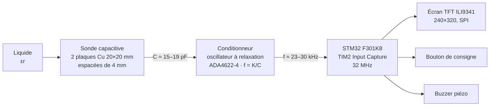
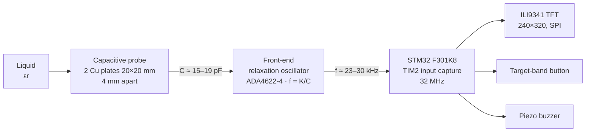

# ALCOSONDE


### 🇫🇷 [Version française](#-version-française) · 🇬🇧 [English version](#-english-version)

<a id="francais"></a>

---

## 🇫🇷 Version française

**Sonde immersible de mesure du titre alcoométrique par voie capacitive, pilotée par un STM32.**

ALCOSONDE mesure le titre alcoométrique d'un liquide (0 à 40 %vol) en exploitant le contraste de permittivité diélectrique entre l'eau (εr ≈ 80) et l'éthanol (εr ≈ 25). Contrairement à la densimétrie, elle reste plongée dans le liquide et suit son évolution en continu, ce qui la destine au suivi d'une fermentation maison (bière, vin, cidre, hydromel) jusqu'au degré visé.

Projet du module *Projet Prototypage*, cursus ISMIN 1<sup>re</sup> année, École nationale supérieure des Mines de Saint-Étienne (2025–2026). Chaîne complète réalisée de bout en bout : validation physique par éléments finis, conception du PCB analogique, gravure de la sonde, firmware embarqué, étalonnage et validation expérimentale.

### Résultats en bref

| Grandeur | Valeur mesurée |
|---|---|
| Plage de mesure | 0 à 40 %vol, par paliers de 5 %vol |
| Capacité de la sonde | 15,3 à 19,4 pF sur la plage utile |
| Fréquence du conditionneur | 23,5 à 29,8 kHz |
| Sensibilité | ≈ 158 Hz/%vol, soit ≈ 0,10 pF/%vol |
| Loi d'étalonnage | C = 0,135·εr + 8,55 (pF), étalonnage 2 points air/eau |
| Linéarité C(εr) simulée | R² > 0,9999 sur 12 points, εr ∈ [25 ; 78] |
| Résolution du timer | ≈ 0,14 %vol par tick (TIM2 à 32 MHz) |
| Validation | 2/2 essais dans la bonne plage (0 %vol et ≈ 17 %vol) |

📄 [Rapport complet (28 pages, PDF)](docs/alcosonde-report.pdf) — méthodologie, simulations, relevés et schémas détaillés.

### Sommaire

- [Principe physique](#principe-physique)
- [Chaîne de mesure](#chaîne-de-mesure)
- [Validation par simulation COMSOL](#validation-par-simulation-comsol)
- [Circuit conditionneur](#circuit-conditionneur)
- [Sonde capacitive](#sonde-capacitive)
- [STM32 et firmware](#stm32-et-firmware)
- [Étalonnage et validation](#étalonnage-et-validation)
- [Simulation contre mesure : l'écart de sensibilité](#simulation-contre-mesure--lécart-de-sensibilité)
- [Compilation et programmation](#compilation-et-programmation)
- [Structure du dépôt](#structure-du-dépôt)
- [Nomenclature](#nomenclature)
- [Limites connues](#limites-connues)
- [Améliorations possibles](#améliorations-possibles)
- [Auteurs et encadrement](#auteurs-et-encadrement)
- [Références](#références)
- [Licence et avertissement](#licence-et-avertissement)

### Principe physique

La capacité d'un condensateur plan s'écrit `C = ε0·εr·S/d`. En figeant la géométrie (deux plaques de 20 × 20 mm espacées de 4 mm), la capacité ne dépend plus que de la permittivité `εr` du liquide entre les armatures.

Or l'eau et l'éthanol ont des permittivités très éloignées, et un mélange des deux prend une valeur intermédiaire, monotone en fonction du titre. Les valeurs d'Åkerlöf à 20 °C [1] :

| Titre (%vol) | 0 | 10 | 20 | 30 | 40 | 60 | 80 | 100 |
|---|---|---|---|---|---|---|---|---|
| εr | 80,1 | 72,8 | 65,0 | 57,1 | 49,7 | 37,0 | 27,3 | 25,1 |

La décroissance monotone garantit l'inversibilité de la mesure. Sur la plage cible, εr parcourt 30 unités, ce qui est le budget de signal dont dispose toute la chaîne.

### Chaîne de mesure



Le choix d'une conversion capacité → fréquence plutôt qu'une mesure d'amplitude est délibéré : la fréquence ne dépend que des composants passifs et de la capacité mesurée, ce qui immunise la chaîne contre les dérives de gain et d'alimentation. Elle produit en outre directement un signal logique lisible par un GPIO, sans CAN.

### Validation par simulation COMSOL

Avant tout achat de matériel, le concept a été validé quantitativement sous **COMSOL Multiphysics 6.2** (module AC/DC, électrostatique stationnaire) pour répondre à deux questions : la capacité tombe-t-elle dans une plage exploitable, et la relation `C(εr)` est-elle assez linéaire pour un étalonnage simple ?

**Méthodologie.** Géométrie 2D cartésienne (la sonde présente une symétrie de translation approximative dans la profondeur), cuve de 300 mm de côté, soit 15 fois la dimension des plaques, pour que les parois ne contribuent plus qu'à moins de 1 % du champ. Maillage triangulaire avec raffinement local à `d/10 = 400 µm` entre les armatures. Balayage paramétrique sur 12 valeurs de `εr` de 25 à 78. La capacité est extraite via `es.C11` (matrice de capacité de Maxwell), définie par l'énergie électrostatique `C = 2·Wel/V0²`. COMSOL retournant une capacité linéique, elle est multipliée par la profondeur réelle de 20 mm.

**Résultats.**

| εr | C simulée (pF) | C plan parfait (pF) | Écart (%) |
|---|---|---|---|
| 25 | 28,8 | 22,1 | 30,1 |
| 40 | 46,1 | 35,4 | 30,1 |
| 55 | 63,4 | 48,7 | 30,1 |
| 70 | 80,6 | 62,0 | 30,1 |
| 78 | 89,9 | 69,1 | 30,1 |

La régression sur les douze points donne `C(εr) = 1,152 pF × εr` avec **R² > 0,9999**.

Le résultat le plus instructif est que **l'écart avec la formule du condensateur plan parfait est constant à 30,1 %** sur tout le balayage. Les effets de bord, négligés par la formule idéale et capturés par la simulation, agissent donc comme une simple homothétie de facteur ≈ 1,30, sans introduire la moindre non-linéarité. Le facteur est élevé parce que le rapport d'aspect `L/d = 5` est faible : les bords pèsent proportionnellement plus. Conséquence pratique : un étalonnage à deux points suffit à absorber intégralement ces effets, il n'y a pas besoin de correction d'ordre supérieur.

En croisant avec les données d'Åkerlöf, la simulation prédit 92,3 pF à 0 %vol et 57,3 pF à 40 %vol, soit 0,88 pF/%vol, et des fréquences de 4,9 à 7,9 kHz. Largement dans le domaine de l'Input Capture : faisabilité confirmée.

### Circuit conditionneur

Le conditionneur convertit la capacité en fréquence par un **oscillateur à relaxation** construit autour d'un AOP quadruple **ADA4622-4** [2], en trois étages :

1. **Référence de demi-alimentation** — diviseur résistif symétrique (2 × 10 kΩ) bouclé sur un suiveur, qui fixe le point milieu du montage en alimentation simple 5 V. Mesuré à 2,51 V pour 2,5 V théoriques.
2. **Intégrateur** — charge la capacité de la sonde à courant constant, produisant une rampe dont la pente dépend de `C`.
3. **Comparateur à hystérésis** — bascule à chaque franchissement de seuil, inversant la rampe. On obtient un triangle sur la capacité et un créneau en sortie, de même période.

La fréquence d'oscillation suit :

```
f = 1 / (2·R6·C·ln(VH/VC))     avec R6 = 1 MΩ
```

Pour un rapport de seuils de 3, le terme logarithmique vaut ln(3) et la constante caractéristique théorique vaut `K = 1/(2·R6·ln3) ≈ 4,55 × 10⁻⁷ F·Hz`.

#### Caractérisation du PCB seul

Le conditionneur a été caractérisé avant même l'existence de la sonde, à 5 V et ≈ 20 °C, dans deux configurations :

| Configuration | Capacité ajoutée | Fréquence mesurée |
|---|---|---|
| À vide (parasite seul) | 0 pF | 111 kHz |
| Capacité céramique étalon (5 %) | 10 pF | 45 kHz |

Comme `f·C` est constant, l'égalité `f₁·Cp = f₂·(Cp + Cref)` donne directement la capacité parasite du PCB :

```
Cp = f₂·Cref / (f₁ − f₂) = 45 × 10 / (111 − 45) ≈ 6,8 pF
K_exp = f·C = 111 kHz × 6,8 pF ≈ 7,5 × 10⁻⁷ F·Hz
```

L'écart de 65 % entre `K_exp` et `K_th` s'explique principalement par le rapport réel des seuils d'hystérésis, fixé par R7/R8, qui s'écarte de la valeur 3 supposée : un rapport proche de 2 suffit à rendre compte de l'observation. S'y ajoutent les non-idéalités des AOP (offset, courants de polarisation, temps de basculement). Le firmware conserve `K_th` et laisse l'étalonnage de la sonde absorber cet écart dans sa pente et son offset.

Le PCB est routé sous **KiCad** au format shield Arduino Nano, pinout partagé avec la Nucleo F301K8, avec plan de masse continu pour limiter les capacités parasites entre pistes.

### Sonde capacitive

**Géométrie.** Deux plaques carrées de cuivre 20 × 20 mm espacées de 4 mm. Ce choix résulte d'un compromis à trois contraintes : une capacité absolue lisible par le conditionneur, un encombrement compatible avec un verre ou une bouteille, et un espacement suffisant pour éviter la capillarité et les bulles piégées.

**Fabrication.** Plaques gravées sur FR4 cuivré 1 oz/ft² (35 µm) sur machine LPKF à l'atelier ID-Fab. Support modélisé sous Fusion 360 et imprimé en 3D dans un matériau supportant une exposition prolongée à l'humidité. Le support remplit trois fonctions : deux fentes parallèles distantes de 6 mm accueillent les électrodes (l'épaisseur de 1 mm de chaque plaque donnant l'espacement utile de 4 mm), une ouverture centrale traversante laisse le liquide circuler entre les armatures, et un manche creux guide les câbles.

**Isolation : le point critique.** Les liquides réels contiennent toujours des ions dissous (calcium, magnésium, chlore dans l'eau du robinet ; sucres et acides organiques dans une boisson fermentée). Sans isolation, ces ions migrent sous l'effet du champ et créent un courant ionique parasite qui ruine la mesure capacitive. Les deux faces des armatures sont donc enduites de **silicone fluide transparent**, qui bloque la conduction tout en se comportant comme une simple capacité en série, préservant la dépendance à `εr`. Ce choix a un coût, quantifié plus bas.

Les deux armatures ne sont pas symétriques électriquement : l'une va au point `SENSOR` du conditionneur, l'autre à la masse. Repérer les câbles pour ne pas les inverser au remontage.

### STM32 et firmware

Carte **STM32 Nucleo F301K8** [4], TIM2 cadencé à 32 MHz en Input Capture. Alimentation, programmation (ST-LINK embarqué) et debug série (VCP, 115200 bauds) passent par le même port USB.

#### Brochage

| Broche | Fonction MCU | Composant |
|---|---|---|
| PA0 | TIM2_CH1 | Sortie du conditionneur (Input Capture) |
| PA2 | USART2_TX | Liaison série VCP (ST-LINK) |
| PA15 | USART2_RX | Liaison série VCP (ST-LINK) |
| PA8 | GPIO sortie | Buzzer piézo actif |
| PB0 | GPIO entrée | Bouton de consigne (tirage interne) |
| PB1 | GPIO sortie | Écran TFT — CS |
| PB3 | SPI3_SCK | Écran TFT — horloge |
| PB5 | SPI3_MOSI | Écran TFT — données |
| PB6 | GPIO sortie | Écran TFT — RST |
| PB7 | GPIO sortie | Écran TFT — DC |
| +5V / +3V3 / GND | Alimentation | Conditionneur / écran / masse commune |


#### Architecture du firmware

Développé sous STM32CubeIDE avec les bibliothèques HAL. Deux flots d'exécution :

- **Routine d'interruption** `HAL_TIM_IC_CaptureCallback`, appelée à chaque front montant sur PA0, qui ne fait que mesurer la période. Le travail lourd n'est délibérément pas fait en interruption.
- **Boucle principale**, cadencée à 120 ms, qui lit le bouton, convertit la période en titre, rafraîchit l'écran et pilote le buzzer.

```c
volatile uint32_t ic_val1 = 0;          // capture precedente
volatile uint32_t ic_val2 = 0;          // capture courante
volatile uint32_t periode_ticks = 0;    // periode mesuree, en ticks d'horloge

void HAL_TIM_IC_CaptureCallback(TIM_HandleTypeDef *htim)
{
    if (htim->Instance == TIM2)
    {
        ic_val2 = HAL_TIM_ReadCapturedValue(htim, TIM_CHANNEL_1);
        periode_ticks = ic_val2 - ic_val1;   // gere le debordement du compteur 32 bits
        ic_val1 = ic_val2;
    }
}
```

La soustraction sur entiers non signés gère naturellement le débordement du compteur 32 bits, sans test explicite.

#### Pipeline de traitement

| Étape | Relation | Constante |
|---|---|---|
| 1. Période → fréquence | `f = F_CLK / periode_ticks` | `F_CLK = 32 MHz` |
| 2. Fréquence → capacité | `C = K / f` | `K = 4,55 × 10⁻⁷ F·Hz` |
| 3. Capacité → permittivité | `εr = (C − CP) / PENTE` | issues de l'étalonnage |
| 4. Permittivité → titre | Åkerlöf linéarisée sur 0–40 %vol | — |
| 5. Titre → affichage | comparaison à la plage de consigne | paliers de 5 %vol |

Le bouton fait avancer cycliquement la plage cible, avec un filtrage logiciel des rebonds à 200 ms. L'écran passe au vert et le buzzer émet un bip lorsque le titre entre dans la plage sélectionnée. Le décor fixe n'est dessiné qu'une fois, seules les valeurs changeantes sont réécrites, pour éviter le clignotement.

### Étalonnage et validation

L'étalonnage utilise deux milieux de permittivité connue, l'air et l'eau distillée :

| Milieu | εr | Fréquence relevée | Capacité déduite |
|---|---|---|---|
| Air (plaques sèches) | ≈ 1 | 52 350 Hz | 8,69 pF |
| Eau distillée (immergée, sans bulles) | ≈ 80,1 | 23 480 Hz | 19,38 pF |

D'où la droite `C = a·εr + Cp` :

```
a  = (19,38 − 8,69) / (80,1 − 1) ≈ 0,135 pF par unité de εr     → #define PENTE
Cp = 8,69 − 0,135 × 1            ≈ 8,55 pF                       → #define CP
```

**Validation.** L'objectif n'est pas le titre au centième mais l'indication correcte de la plage. Deux essais :

| Liquide | Titre réel | Consigne | Résultat |
|---|---|---|---|
| Eau distillée | 0 %vol | 0–5 %vol | ✅ écran vert + bip |
| Solution éthanol/eau | ≈ 17 %vol | 15–20 %vol | ✅ écran vert + bip |

Dans les deux cas l'appareil a situé le liquide dans la bonne plage. Cette validation reste à étendre à des boissons commerciales de titre certifié (vin, spiritueux dilués) pour couvrir une gamme plus large.

### Simulation contre mesure : l'écart de sensibilité

C'est le résultat le plus honnête du projet, et celui qui mérite d'être lu en premier par quiconque voudrait reprendre la sonde.

| | Pente de C(εr) | Sensibilité |
|---|---|---|
| Simulation COMSOL | 1,152 pF par unité de εr | 0,88 pF/%vol |
| Mesure après montage | 0,135 pF par unité de εr | ≈ 0,10 pF/%vol |
| **Rapport** | **≈ 8,5×** | |

La sensibilité réelle est donc près de neuf fois plus faible que celle prédite. L'explication retenue est le **film de silicone déposé sur les électrodes** : il forme une capacité en série avec la capacité utile, et une capacité en série plus petite que sa voisine impose sa propre valeur au résultat. Le revêtement préserve la dépendance à `εr`, mais en écrase fortement l'amplitude. La simulation, elle, modélisait des électrodes nues.

Deux conséquences directes :

- La plage de fréquence réelle se situe autour de **23,5 à 29,8 kHz** pour 0 à 40 %vol, et non 4,9 à 7,9 kHz comme prévu.
- Avec TIM2 à 32 MHz, un tick de quantification correspond à ≈ **0,14 %vol**, soit environ 36 ticks par palier de 5 %vol. La résolution de la chaîne de mesure n'est donc pas le facteur limitant : **c'est le bruit et la dérive qui imposent l'affichage par plages**, pas le timer.

La leçon de conception est qu'un modèle électrostatique d'électrodes nues ne suffit pas à dimensionner une sonde destinée à être isolée. Une prochaine itération devrait intégrer le revêtement dans la simulation, ou réduire son épaisseur pour récupérer de la sensibilité.

### Compilation et programmation

```bash
git clone https://github.com/maaabz/Alcosonde.git
```

1. Installer STM32CubeIDE.
2. `File > Import > Existing Projects into Workspace`, pointer sur `firmware/`.
3. Renseigner les constantes `CP` et `PENTE` issues de votre propre étalonnage (voir ci-dessus) dans `main.c`.
4. Compiler (**Build**), brancher la carte en USB et flasher (**Run**) via le ST-LINK intégré.
5. Ouvrir un terminal série à **115200 bauds** pour suivre les mesures brutes.

> **Recalibrer après tout changement mécanique** de la sonde : collage des électrodes, réapplication du silicone, remplacement d'un câble. La géométrie et le revêtement fixent la pente, et ils bougent.

### Structure du dépôt

```
alcosonde/
├── firmware/             # Projet STM32CubeIDE (main.c, configuration CubeMX)
├── hardware/
│   ├── front-end/        # Schéma et routage KiCad du conditionneur
│   └── probe/            # Modèles Fusion 360 du support et du boîtier
├── simulation/           # Modèle COMSOL 6.2 et résultats du balayage
├── docs/                 # Rapport PDF et figures
└── README.md
```

### Nomenclature

| Élément | Référence | Rôle |
|---|---|---|
| Microcontrôleur | STM32 Nucleo F301K8 | Acquisition et traitement |
| AOP quadruple | ADA4622-4 | Oscillateur à relaxation |
| Écran | TFT ILI9341, 240 × 320, SPI | Affichage |
| Sonde | FR4 cuivré 1 oz/ft² (35 µm) | Armatures 20 × 20 mm |
| Isolant | Silicone fluide transparent | Blocage de la conduction ionique |
| Buzzer | Piézo actif 5 V | Alerte sonore |
| Bouton | Poussoir | Sélection de la consigne |
| Mécanique | Filament d'impression 3D | Support de sonde et boîtier |

Résistance de charge `R6 = 1 MΩ`, diviseur de référence 2 × 10 kΩ, seuils d'hystérésis fixés par R7/R8 (voir le schéma KiCad).

### Limites connues

- **Ambiguïté sucre / alcool.** Un mélange eau-sucre présente une permittivité voisine d'un mélange eau-éthanol : la sonde ne les distingue pas. En cours de fermentation, où le sucre se convertit progressivement en alcool, la mesure est indicative et non absolue. C'est la limite la plus fondamentale du principe retenu.
- **Sensibilité écrasée par l'isolant**, d'un facteur ≈ 8,5 par rapport à la simulation (voir la section dédiée).
- **Résolution dégradée au-delà de 30 %vol**, où la permittivité du mélange varie plus lentement avec le titre.
- **Pas de compensation thermique.** La permittivité de l'eau dépend de la température : mesurer sur un liquide à l'équilibre, jamais en régime transitoire.
- **Bruit résiduel** sur la mesure de fréquence, qui motive l'affichage par plages plutôt qu'une valeur précise. L'écran affiche tout de même une valeur en %vol, utilisée avant tout pour la mise au point.
- **Sensibilité à l'immersion.** Bulles piégées et immersion partielle faussent la lecture. Immerger complètement, chasser les bulles, sécher soigneusement l'interstice entre deux mesures.

### Améliorations possibles

- **Compteur de bulles de CO₂** sur le barboteur du récipient de fermentation, par LED infrarouge et phototransistor. Cette mesure indépendante lèverait l'ambiguïté sucre/alcool, qui est la vraie faiblesse du prototype.
- **Modéliser le revêtement silicone** dans COMSOL, ou en réduire l'épaisseur, pour récupérer la sensibilité perdue.
- **Compensation thermique** par sonde de température et correction de la loi `εr(T)`.
- **Filtrage logiciel** de la fréquence (moyenne glissante ou médiane) pour réduire le bruit et affiner la détection des plages.
- **Connectivité Bluetooth** et historique des mesures sur smartphone, pour tracer la courbe de fermentation.
- **Boîtier étanche IP67** et sonde multi-points le long d'un manche plus long, pour vérifier l'homogénéité d'une cuve.

### Auteurs et encadrement

Projet réalisé en binôme dans le cadre du cursus ISMIN 1<sup>re</sup> année (promo EI25), École nationale supérieure des Mines de Saint-Étienne. Ce dépôt est maintenu par **Mathieu Abou Zeid**.

Encadrement : François Bernier, Roger Delattre et Sylvain Blayac. Fabrication à l'atelier de prototypage ID-Fab (gravure LPKF et impression 3D).

*Transparence sur l'usage de l'IA : des outils d'IA ont servi d'assistance pour la mise en forme du rapport, la relecture, la discussion de certains choix de conception et le débogage du firmware. La conception du dispositif, sa réalisation, les mesures, les simulations, l'étalonnage et l'interprétation des résultats sont notre travail.*

### Références

1. G. Åkerlöf, *Dielectric constants of some organic solvent-water mixtures at various temperatures*, Journal of the American Chemical Society, vol. 54, n° 11, p. 4125–4139, 1932. [doi:10.1021/ja01350a001](https://doi.org/10.1021/ja01350a001)
2. Analog Devices, *ADA4622-1/-2/-4 : 30 V, 8 MHz, Low Bias Current, Single-Supply, RRO, Precision Op Amps*, Rev. F, 2015. [Fiche technique](https://www.analog.com/en/products/ada4622-4.html)
3. ILITEK, *ILI9341 : a-Si TFT LCD Single Chip Driver (240×320, 262k couleurs)*, v1.11. [Fiche technique](https://cdn-shop.adafruit.com/datasheets/ILI9341.pdf)
4. STMicroelectronics, *UM1956 — STM32 Nucleo-32 boards (MB1180)*, Rev. 5, 2018. [Manuel](https://www.st.com/resource/en/user_manual/um1956-stm32-nucleo32-boards-mb1180-stmicroelectronics.pdf)
5. COMSOL AB, *AC/DC Module User's Guide* et *COMSOL Multiphysics Reference Manual*, v6.2, 2024.
6. afiskon, *stm32-ili9341 — STM32 HAL-based library for ILI9341 TFT modules*. [Dépôt GitHub](https://github.com/afiskon/stm32-ili9341)

### Licence et avertissement

Code et documentation sous [licence MIT](LICENSE).

> **Avertissement.** ALCOSONDE est un prototype pédagogique. Il fournit une mesure indicative et n'est pas un instrument certifié. Il ne doit en aucun cas servir à évaluer l'aptitude à conduire ni à prendre une décision liée à la consommation d'alcool.

<a id="english"></a>

---

## 🇬🇧 English version

**An immersible capacitive probe for measuring alcohol by volume, driven by an STM32.**

ALCOSONDE measures the alcohol content of a liquid (0 to 40 %vol) by exploiting the dielectric permittivity contrast between water (εr ≈ 80) and ethanol (εr ≈ 25). Unlike hydrometry, it stays submerged and tracks the liquid continuously, which makes it suited to following a home fermentation (beer, wine, cider, mead) until the target strength is reached.

Built for the *Prototyping Project* module, first-year ISMIN program, École nationale supérieure des Mines de Saint-Étienne (2025–2026). The full chain was designed end to end: finite-element validation of the physics, analog front-end design, probe fabrication, embedded firmware, calibration and experimental validation.

### Results at a glance

| Quantity | Measured value |
|---|---|
| Measurement range | 0 to 40 %vol, in 5 %vol bands |
| Probe capacitance | 15.3 to 19.4 pF over the useful range |
| Front-end frequency | 23.5 to 29.8 kHz |
| Sensitivity | ≈ 158 Hz/%vol, i.e. ≈ 0.10 pF/%vol |
| Calibration law | C = 0.135·εr + 8.55 (pF), two-point air/water |
| Simulated C(εr) linearity | R² > 0.9999 over 12 points, εr ∈ [25, 78] |
| Timer resolution | ≈ 0.14 %vol per tick (TIM2 at 32 MHz) |
| Validation | 2/2 trials landed in the correct band (0 %vol and ≈ 17 %vol) |

📄 [Full report (28 pages, PDF, in French)](docs/alcosonde-report.pdf) — methodology, simulations, measurements and detailed schematics.

### Contents

- [Physical principle](#physical-principle)
- [Measurement chain](#measurement-chain)
- [COMSOL validation](#comsol-validation)
- [Analog front-end](#analog-front-end)
- [Capacitive probe](#capacitive-probe)
- [STM32 and firmware](#stm32-and-firmware)
- [Calibration and validation](#calibration-and-validation)
- [Simulation vs. measurement: the sensitivity gap](#simulation-vs-measurement-the-sensitivity-gap)
- [Build and flash](#build-and-flash)
- [Repository layout](#repository-layout)
- [Bill of materials](#bill-of-materials)
- [Known limitations](#known-limitations)
- [Possible improvements](#possible-improvements)
- [Authors and supervision](#authors-and-supervision)
- [References](#references)
- [License and disclaimer](#license-and-disclaimer)

### Physical principle

The capacitance of a parallel-plate capacitor is `C = ε0·εr·S/d`. With the geometry fixed (two 20 × 20 mm plates, 4 mm apart), capacitance depends only on the permittivity `εr` of the liquid between the plates.

Water and ethanol sit far apart in permittivity, and a mixture of the two takes an intermediate value that is monotonic in alcohol content. Åkerlöf's values at 20 °C [1]:

| ABV (%vol) | 0 | 10 | 20 | 30 | 40 | 60 | 80 | 100 |
|---|---|---|---|---|---|---|---|---|
| εr | 80.1 | 72.8 | 65.0 | 57.1 | 49.7 | 37.0 | 27.3 | 25.1 |

Monotonicity guarantees the measurement is invertible. Across the target range εr spans 30 units, and that span is the entire signal budget the rest of the chain has to work with.

### Measurement chain



Converting capacitance to frequency rather than measuring an amplitude was a deliberate choice: frequency depends only on the passive components and the sensed capacitance, which makes the chain immune to gain and supply drift. It also yields a logic-level signal a GPIO can read directly, with no ADC in the path.

### COMSOL validation

Before buying any hardware, the concept was validated quantitatively in **COMSOL Multiphysics 6.2** (AC/DC module, stationary electrostatics) to answer two questions: does the capacitance land in a range the front-end can work with, and is `C(εr)` linear enough for a simple calibration?

**Method.** 2D Cartesian geometry (the probe has approximate translational symmetry along its depth), a 300 mm tank — fifteen times the plate dimension — so that the walls contribute under 1 % of the field. Triangular mesh with local refinement to `d/10 = 400 µm` between the plates. Parametric sweep over 12 values of `εr` from 25 to 78. Capacitance is extracted through `es.C11` (Maxwell capacitance matrix), defined from the electrostatic energy as `C = 2·Wel/V0²`. COMSOL returns capacitance per unit depth, so the result is scaled by the real 20 mm depth.

**Results.**

| εr | Simulated C (pF) | Ideal parallel plate (pF) | Deviation (%) |
|---|---|---|---|
| 25 | 28.8 | 22.1 | 30.1 |
| 40 | 46.1 | 35.4 | 30.1 |
| 55 | 63.4 | 48.7 | 30.1 |
| 70 | 80.6 | 62.0 | 30.1 |
| 78 | 89.9 | 69.1 | 30.1 |

Regression over the twelve points gives `C(εr) = 1.152 pF × εr`, with **R² > 0.9999**.

The most instructive result is that **the deviation from the ideal parallel-plate formula is constant at 30.1 %** across the whole sweep. Fringing fields, which the ideal formula ignores and the simulation captures, therefore act as a pure scaling by ≈ 1.30 and introduce no non-linearity whatsoever. The factor is large because the aspect ratio `L/d = 5` is low, so the edges carry proportionally more weight. The practical consequence: a two-point calibration absorbs the effect entirely, and no higher-order correction is needed.

Cross-referencing Åkerlöf's data, the simulation predicts 92.3 pF at 0 %vol and 57.3 pF at 40 %vol, i.e. 0.88 pF/%vol, and frequencies from 4.9 to 7.9 kHz. Comfortably within input-capture territory, so feasibility was confirmed.

### Analog front-end

The front-end converts capacitance to frequency with a **relaxation oscillator** built around an **ADA4622-4** quad op-amp [2], in three stages:

1. **Mid-supply reference** — a symmetric 2 × 10 kΩ divider buffered by a unity-gain follower, setting the virtual ground for single-supply 5 V operation. Measured at 2.51 V against 2.5 V nominal.
2. **Integrator** — charges the probe capacitance at constant current, producing a ramp whose slope depends on `C`.
3. **Hysteresis comparator** — flips at each threshold crossing, reversing the ramp. The result is a triangle wave across the capacitance and a square wave at the output, sharing the same period.

The oscillation frequency follows:

```
f = 1 / (2·R6·C·ln(VH/VC))     with R6 = 1 MΩ
```

For a threshold ratio of 3 the logarithmic term is ln(3), giving a theoretical characteristic constant `K = 1/(2·R6·ln3) ≈ 4.55 × 10⁻⁷ F·Hz`.

#### Characterizing the board on its own

The front-end was characterized before the probe even existed, at 5 V and ≈ 20 °C, in two configurations:

| Configuration | Added capacitance | Measured frequency |
|---|---|---|
| Unloaded (parasitics only) | 0 pF | 111 kHz |
| Reference ceramic cap (5 %) | 10 pF | 45 kHz |

Since `f·C` is constant, setting `f₁·Cp = f₂·(Cp + Cref)` yields the board's parasitic capacitance directly:

```
Cp = f₂·Cref / (f₁ − f₂) = 45 × 10 / (111 − 45) ≈ 6.8 pF
K_exp = f·C = 111 kHz × 6.8 pF ≈ 7.5 × 10⁻⁷ F·Hz
```

The 65 % gap between `K_exp` and `K_th` comes mainly from the actual hysteresis threshold ratio, set by R7/R8, departing from the assumed value of 3 — a ratio nearer 2 accounts for the observation on its own. Op-amp non-idealities (offset voltage, bias currents, comparator propagation delay) contribute the remainder. The firmware keeps `K_th` and lets the probe calibration absorb the discrepancy into its slope and offset.

The board is laid out in **KiCad** as an Arduino Nano shield — a pinout the Nucleo F301K8 shares — with a continuous ground plane to keep trace-to-trace parasitics down.

### Capacitive probe

**Geometry.** Two 20 × 20 mm square copper plates, 4 mm apart. The dimensions came out of a three-way trade-off: absolute capacitance the front-end can resolve, a footprint that fits a glass or a bottle, and a gap wide enough to avoid capillary effects and trapped bubbles.

**Fabrication.** Plates etched on 1 oz/ft² (35 µm) copper-clad FR4 on an LPKF mill at the school's ID-Fab workshop. The holder was modeled in Fusion 360 and 3D-printed in a material rated for prolonged humidity exposure. It serves three purposes: two parallel slots 6 mm apart hold the electrodes (each plate being 1 mm thick, which yields the 4 mm working gap), a central through-opening lets liquid circulate between the plates, and a hollow handle routes the cables.

**Insulation: the critical detail.** Real liquids always carry dissolved ions — calcium, magnesium and chlorine in tap water; sugars and organic acids in a fermenting beverage. Without insulation those ions drift under the field and create a parasitic ionic current that destroys the capacitive measurement. Both faces of the plates are therefore coated in **clear fluid silicone**, which blocks conduction while behaving as a simple series capacitance, preserving the dependence on `εr`. That choice carries a cost, quantified below.

The two plates are not electrically symmetric: one goes to the front-end's `SENSOR` node, the other to ground. Mark the cables so they don't get swapped during reassembly.

### STM32 and firmware

**STM32 Nucleo F301K8** board [4], TIM2 clocked at 32 MHz in input-capture mode. Power, programming (on-board ST-LINK) and serial debug (VCP, 115200 baud) all go through the same USB port.

#### Pinout

| Pin | MCU function | Component |
|---|---|---|
| PA0 | TIM2_CH1 | Front-end output (input capture) |
| PA2 | USART2_TX | VCP serial link (ST-LINK) |
| PA15 | USART2_RX | VCP serial link (ST-LINK) |
| PA8 | GPIO output | Active piezo buzzer |
| PB0 | GPIO input | Target-band button (internal pull-up) |
| PB1 | GPIO output | TFT — CS |
| PB3 | SPI3_SCK | TFT — clock |
| PB5 | SPI3_MOSI | TFT — data |
| PB6 | GPIO output | TFT — RST |
| PB7 | GPIO output | TFT — DC |
| +5V / +3V3 / GND | Power | Front-end / display / common ground |


#### Firmware architecture

Developed in STM32CubeIDE on the HAL libraries. Two execution paths:

- An **interrupt service routine**, `HAL_TIM_IC_CaptureCallback`, fired on every rising edge on PA0, which does nothing but measure the period. The heavy work is deliberately kept out of the ISR.
- A **main loop** running on a 120 ms tick, which polls the button, converts the period into an ABV figure, refreshes the display and drives the buzzer.

```c
volatile uint32_t ic_val1 = 0;          // previous capture
volatile uint32_t ic_val2 = 0;          // current capture
volatile uint32_t periode_ticks = 0;    // measured period, in timer ticks

void HAL_TIM_IC_CaptureCallback(TIM_HandleTypeDef *htim)
{
    if (htim->Instance == TIM2)
    {
        ic_val2 = HAL_TIM_ReadCapturedValue(htim, TIM_CHANNEL_1);
        periode_ticks = ic_val2 - ic_val1;   // unsigned wraparound handles 32-bit overflow
        ic_val1 = ic_val2;
    }
}
```

Unsigned subtraction handles the 32-bit counter rollover naturally, with no explicit test.

#### Processing pipeline

| Step | Relation | Constant |
|---|---|---|
| 1. Period → frequency | `f = F_CLK / periode_ticks` | `F_CLK = 32 MHz` |
| 2. Frequency → capacitance | `C = K / f` | `K = 4.55 × 10⁻⁷ F·Hz` |
| 3. Capacitance → permittivity | `εr = (C − CP) / PENTE` | from calibration |
| 4. Permittivity → ABV | Åkerlöf, linearized over 0–40 %vol | — |
| 5. ABV → display | compared against the target band | 5 %vol steps |

The button cycles through target bands, with a 200 ms software debounce. The screen turns green and the buzzer chirps once the reading enters the selected band. Static screen furniture is drawn once and only changing values are rewritten, which avoids flicker.

### Calibration and validation

Calibration uses two media of known permittivity, air and distilled water:

| Medium | εr | Measured frequency | Derived capacitance |
|---|---|---|---|
| Air (dry plates) | ≈ 1 | 52,350 Hz | 8.69 pF |
| Distilled water (submerged, bubble-free) | ≈ 80.1 | 23,480 Hz | 19.38 pF |

Which gives the line `C = a·εr + Cp`:

```
a  = (19.38 − 8.69) / (80.1 − 1) ≈ 0.135 pF per unit of εr     → #define PENTE
Cp = 8.69 − 0.135 × 1            ≈ 8.55 pF                      → #define CP
```

**Validation.** The goal is not ABV to two decimals but correctly reporting the band. Two trials:

| Liquid | Actual ABV | Target band | Outcome |
|---|---|---|---|
| Distilled water | 0 %vol | 0–5 %vol | ✅ green screen + chirp |
| Ethanol/water solution | ≈ 17 %vol | 15–20 %vol | ✅ green screen + chirp |

In both cases the device placed the liquid in the right band. This still needs extending to commercial beverages of certified strength (wine, diluted spirits) to cover a wider range.

### Simulation vs. measurement: the sensitivity gap

This is the most honest result of the project, and the first thing anyone picking up the probe should read.

| | Slope of C(εr) | Sensitivity |
|---|---|---|
| COMSOL simulation | 1.152 pF per unit of εr | 0.88 pF/%vol |
| Measured after assembly | 0.135 pF per unit of εr | ≈ 0.10 pF/%vol |
| **Ratio** | **≈ 8.5×** | |

Real sensitivity is therefore close to nine times lower than predicted. The explanation we settled on is the **silicone film on the electrodes**: it forms a capacitance in series with the sensing capacitance, and a series capacitance smaller than its neighbour dominates the result. The coating preserves the dependence on `εr` but heavily compresses its amplitude. The simulation, meanwhile, modeled bare electrodes.

Two direct consequences:

- The real frequency band sits around **23.5 to 29.8 kHz** for 0 to 40 %vol, not the 4.9 to 7.9 kHz predicted.
- With TIM2 at 32 MHz, one quantization tick corresponds to ≈ **0.14 %vol**, about 36 ticks per 5 %vol band. Measurement resolution is therefore not the bottleneck: **noise and drift are what force the banded display**, not the timer.

The design lesson is that an electrostatic model of bare electrodes is not sufficient to size a probe that will be coated. A next iteration should either include the coating in the simulation or thin it down to recover sensitivity.

### Build and flash

```bash
git clone https://github.com/maaabz/Alcosonde.git
```

1. Install STM32CubeIDE.
2. `File > Import > Existing Projects into Workspace`, pointing at `firmware/`.
3. Set the `CP` and `PENTE` constants in `main.c` from your own calibration (see above).
4. **Build**, connect the board over USB and **Run** to flash through the on-board ST-LINK.
5. Open a serial terminal at **115200 baud** to watch the raw readings.

> **Recalibrate after any mechanical change** to the probe: re-gluing the electrodes, reapplying silicone, replacing a cable. Geometry and coating set the slope, and both move.

### Repository layout

```
alcosonde/
├── firmware/             # STM32CubeIDE project (main.c, CubeMX configuration)
├── hardware/
│   ├── front-end/        # KiCad schematic and layout for the conditioning board
│   └── probe/            # Fusion 360 models of the probe holder and enclosure
├── simulation/           # COMSOL 6.2 model and sweep results
├── docs/                 # PDF report and figures
└── README.md
```

### Bill of materials

| Item | Part | Role |
|---|---|---|
| Microcontroller | STM32 Nucleo F301K8 | Acquisition and processing |
| Quad op-amp | ADA4622-4 | Relaxation oscillator |
| Display | ILI9341 TFT, 240 × 320, SPI | User readout |
| Probe | 1 oz/ft² (35 µm) copper-clad FR4 | 20 × 20 mm plates |
| Insulation | Clear fluid silicone | Blocks ionic conduction |
| Buzzer | 5 V active piezo | Audible alert |
| Button | Momentary push-button | Target-band selection |
| Mechanical | 3D printing filament | Probe holder and enclosure |

Charging resistor `R6 = 1 MΩ`, 2 × 10 kΩ reference divider, hysteresis thresholds set by R7/R8 (see the KiCad schematic).

### Known limitations

- **Sugar / alcohol ambiguity.** A water-sugar mixture has a permittivity close to a water-ethanol one, so the probe cannot tell them apart. Mid-fermentation, where sugar is progressively converted into alcohol, the reading is indicative rather than absolute. This is the most fundamental limitation of the approach.
- **Sensitivity compressed by the insulation**, by a factor of ≈ 8.5 relative to simulation (see the dedicated section).
- **Degraded resolution above 30 %vol**, where mixture permittivity varies more slowly with alcohol content.
- **No temperature compensation.** Water permittivity is temperature-dependent: measure on a liquid at equilibrium, never in a transient.
- **Residual noise** on the frequency measurement, which is what motivates the banded display over a precise figure. The screen does show a %vol value, used mostly for debugging.
- **Sensitivity to immersion quality.** Trapped bubbles and partial immersion corrupt the reading. Submerge fully, clear the bubbles, and dry the gap carefully between measurements.

### Possible improvements

- **CO₂ bubble counter** on the fermentation vessel's airlock, using an infrared LED and phototransistor. That independent measurement would resolve the sugar/alcohol ambiguity, which is the prototype's real weakness.
- **Model the silicone coating** in COMSOL, or thin it down, to recover the lost sensitivity.
- **Temperature compensation** via a temperature sensor and correction of the `εr(T)` law.
- **Software filtering** of the measured frequency (moving average or median) to cut noise and sharpen band detection.
- **Bluetooth connectivity** and measurement history on a phone, to plot the fermentation curve.
- **IP67 enclosure** and a multi-point probe along a longer handle, to check homogeneity across a fermentation vessel.

### Authors and supervision

Two-person team project for the first-year ISMIN program (EI25 cohort), École nationale supérieure des Mines de Saint-Étienne. This repository is maintained by **Mathieu Abou Zeid**.

Supervised by François Bernier, Roger Delattre and Sylvain Blayac. Fabrication at the ID-Fab prototyping workshop (LPKF milling and 3D printing).

*Disclosure on AI use: AI tools assisted with report formatting, proofreading, discussion of some design choices, and firmware debugging. The design of the device, its fabrication, the measurements, the simulations, the calibration and the interpretation of results are our own work.*

### References

1. G. Åkerlöf, *Dielectric constants of some organic solvent-water mixtures at various temperatures*, Journal of the American Chemical Society, vol. 54, no. 11, pp. 4125–4139, 1932. [doi:10.1021/ja01350a001](https://doi.org/10.1021/ja01350a001)
2. Analog Devices, *ADA4622-1/-2/-4: 30 V, 8 MHz, Low Bias Current, Single-Supply, RRO, Precision Op Amps*, Rev. F, 2015. [Datasheet](https://www.analog.com/en/products/ada4622-4.html)
3. ILITEK, *ILI9341: a-Si TFT LCD Single Chip Driver (240×320, 262k colors)*, v1.11. [Datasheet](https://cdn-shop.adafruit.com/datasheets/ILI9341.pdf)
4. STMicroelectronics, *UM1956 — STM32 Nucleo-32 boards (MB1180)*, Rev. 5, 2018. [User manual](https://www.st.com/resource/en/user_manual/um1956-stm32-nucleo32-boards-mb1180-stmicroelectronics.pdf)
5. COMSOL AB, *AC/DC Module User's Guide* and *COMSOL Multiphysics Reference Manual*, v6.2, 2024.
6. afiskon, *stm32-ili9341 — STM32 HAL-based library for ILI9341 TFT modules*. [GitHub repository](https://github.com/afiskon/stm32-ili9341)

### License and disclaimer

Code and documentation released under the [MIT license](LICENSE).

> **Disclaimer.** ALCOSONDE is an educational prototype. It gives an indicative reading and is not a certified instrument. It must never be used to assess fitness to drive or to inform any decision related to alcohol consumption.
